# ユーザ認証
サービスごとに別々の認証をするのではなく、統合した認証システムを提供します。

## Authの中央認証
- **パスワードのハッシュ化** 
    passwordをそのまま保存するのではなく、ハッシュ化(不可逆化)して管理することで不正に流出した場合の被害を防ぐことができる(`bcrypt`を利用する)
- **JWT** 
    JWTは『ヘッダ』『ペイロード』『署名』の3部分から成り、トークン認証としてアプリ側で秘密鍵を使って変換し、そのデータに基づいてレスポンスを返す方式

## DB ER図

```mermaid
erDiagram
    ACCOUNT ||--o{ IDENTITY_EMAIL : "has"
    ACCOUNT ||--o{ CREDENTIAL_PASSWORD : "has"
    ACCOUNT ||--o{ PASSWORD_HISTORY : "has"
    ACCOUNT ||--o{ CREDENTIAL_WEBAUTHN : "has"
    ACCOUNT ||--o{ CREDENTIAL_OAUTH : "links"
    ACCOUNT ||--o{ MFA_FACTOR : "enables"
    ACCOUNT ||--o{ RECOVERY_CODE : "owns"
    ACCOUNT ||--o{ SESSION : "opens"
    ACCOUNT ||--o{ ACTION_TOKEN : "receives"
    ACCOUNT ||--o{ AUDIT_LOG : "emits"
    ACCOUNT ||--o{ ORGANIZATION_MEMBER : "belongs to"

    APP ||--o{ ACCOUNT_APP : "provisions"
    ACCOUNT ||--o{ ACCOUNT_APP : "uses"
    APP ||--o{ ROLE : "defines"
    APP ||--o{ PERMISSION : "defines"
    ROLE ||--o{ ROLE_PERMISSION : "grants"
    PERMISSION ||--o{ ROLE_PERMISSION : "granted by"
    ACCOUNT_APP ||--o{ ACCOUNT_APP_ROLE : "assigned"
    ROLE ||--o{ ACCOUNT_APP_ROLE : "assigned to"

    APP ||--o{ SESSION : "used by"
    SESSION ||--o{ REFRESH_TOKEN : "rotates"
    APP ||--o{ AUDIT_LOG : "context"

    ORGANIZATION ||--o{ ORGANIZATION_MEMBER : "has"

    ACCOUNT {
        uuid id PK
        text status "active|locked|disabled"
        timestamptz created_at
        timestamptz updated_at
    }

    IDENTITY_EMAIL {
        uuid id PK
        uuid account_id FK
        citext email_norm "UNIQUE"
        boolean is_primary
        timestamptz verified_at
        timestamptz created_at
    }

    CREDENTIAL_PASSWORD {
        uuid id PK
        uuid account_id FK
        text algo "argon2id等"
        text hash
        timestamptz created_at
        timestamptz disabled_at
    }

    PASSWORD_HISTORY {
        uuid id PK
        uuid account_id FK
        text hash
        timestamptz created_at
    }

    CREDENTIAL_WEBAUTHN {
        uuid id PK
        uuid account_id FK
        bytea credential_id "UNIQUE"
        bytea public_key
        bigint sign_count
        text[] transports
        text attestation_fmt
        timestamptz created_at
        timestamptz last_used_at
    }

    CREDENTIAL_OAUTH {
        uuid id PK
        uuid account_id FK
        text provider
        text provider_uid
        bytea access_token_enc
        bytea refresh_token_enc
        timestamptz linked_at
    }

    APP {
        uuid id PK
        text name
        text client_id "UNIQUE"
        text client_secret_hash
        text[] redirect_uris
        boolean first_party
        timestamptz created_at
    }

    ACCOUNT_APP {
        uuid id PK
        uuid account_id FK
        uuid app_id FK
        jsonb profile_json
        text status
        timestamptz created_at
    }

    ROLE {
        uuid id PK
        uuid app_id FK
        text name
    }

    PERMISSION {
        uuid id PK
        uuid app_id FK
        text name
    }

    ROLE_PERMISSION {
        uuid role_id FK
        uuid permission_id FK
    }

    ACCOUNT_APP_ROLE {
        uuid account_app_id FK
        uuid role_id FK
    }

    MFA_FACTOR {
        uuid id PK
        uuid account_id FK
        text type "totp|webauthn|sms"
        bytea secret_enc
        timestamptz enabled_at
    }

    RECOVERY_CODE {
        uuid id PK
        uuid account_id FK
        text code_hash
        timestamptz used_at
    }

    SESSION {
        uuid id PK
        uuid account_id FK
        uuid app_id FK
        uuid device_id
        inet ip
        text user_agent
        timestamptz created_at
        timestamptz expires_at
    }

    REFRESH_TOKEN {
        uuid jti PK
        uuid session_id FK
        uuid account_id FK
        uuid app_id FK
        text token_hash "UNIQUE"
        uuid parent_jti
        timestamptz created_at
        timestamptz expires_at
        timestamptz revoked_at
        timestamptz reused_at
    }

    ACTION_TOKEN {
        uuid id PK
        uuid account_id FK
        text kind "email_verify|password_reset|consent"
        text token_hash "UNIQUE"
        timestamptz expires_at
        timestamptz used_at
    }

    AUDIT_LOG {
        uuid id PK
        uuid account_id FK
        uuid app_id FK
        text event
        inet ip
        text user_agent
        jsonb data
        timestamptz created_at
    }

    ORGANIZATION {
        uuid id PK
        text name
        timestamptz created_at
    }

    ORGANIZATION_MEMBER {
        uuid org_id FK
        uuid account_id FK
        text role "owner|admin|member"
    }
```

## ユーザ情報
1. **id** 
2. email

3. hashed_password

4. roles